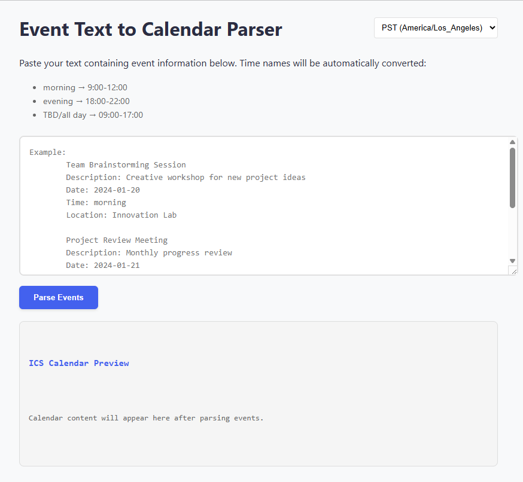
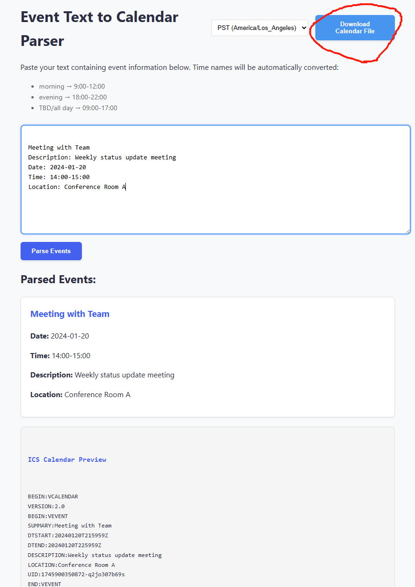

# Event Parser

### Have you received an event description in text form? Do you want to import the text based events into your calendar with one click? You are in the right place!

A Django-based event parser that extracts structured event information from text descriptions. The parser can handle single and multiple events, including details like dates, times, titles, locations, and descriptions.

This is currently localy hosted on my personal server, but I plan on hosting it on a cloud service in the future for easy access. Currently you will need to add your own API key.

## Screenshots

### Landing page



### Simply copy your event in text into the box, click parse event!



## Installation

1. Clone the repository:
```bash
git clone <repository-url>
cd event-parser
```

2. Create and activate a virtual environment:
```bash
python -m venv venv
source venv/bin/activate  # On Windows: venv\Scripts\activate
```

3. Install dependencies:
```bash
pip install -r requirements.txt
```

4. Apply database migrations:
```bash
python manage.py migrate
```

## Usage

1. Start the development server:
```bash
python manage.py runserver
```

2. Open your web browser and navigate to local host that your previous step instructed you to do

## API Documentation

### POST /parse-event/

Parses event information from text.

**Request Body:**
```json
{
    "text": "string"
}
```

**Response:**
```json
{
    "events": [
        {
            "title": "string",
            "date": "YYYY-MM-DD",
            "time": "HH:MM-HH:MM",
            "location": "string",
            "description": "string"
        }
    ]
}
```

## Testing

Run the test suite:
```bash
python manage.py test
```

## License

This project is licensed under the MIT License - see the [LICENSE](LICENSE) file for details.