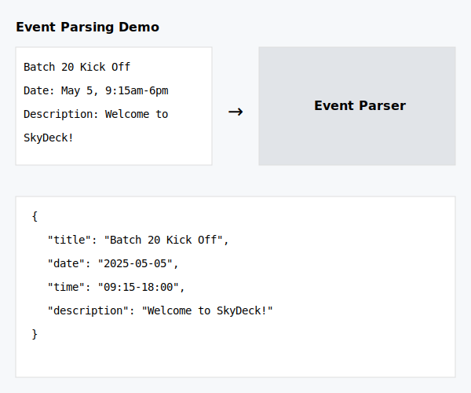

# Event Parser

A Django-based event parser that extracts structured event information from text descriptions. The parser can handle single and multiple events, including details like dates, times, titles, locations, and descriptions.

## Features

- Parse single or multiple events from text descriptions
- Extract event details including:
  - Title
  - Date (YYYY-MM-DD format)
  - Time (HH:MM-HH:MM format)
  - Location
  - Description
- RESTful API endpoint for event parsing
- Comprehensive test coverage

## Screenshots

### API Response Example


### Sample Event Parsing



## Installation

1. Clone the repository:
```bash
git clone <repository-url>
cd event-parser
```

2. Create and activate a virtual environment:
```bash
python -m venv venv
source venv/bin/activate  # On Windows: venv\Scripts\activate
```

3. Install dependencies:
```bash
pip install -r requirements.txt
```

4. Apply database migrations:
```bash
python manage.py migrate
```

## Usage

1. Start the development server:
```bash
python manage.py runserver
```

2. Send a POST request to the parsing endpoint:
```bash
curl -X POST http://localhost:8000/parse-event/ \
  -H "Content-Type: application/json" \
  -d '{"text": "Batch 20 Kick Off & Orientation\nDate: May 5, 9:15am-6pm\nDescription: Welcome to SkyDeck!"}'
```

## API Documentation

### POST /parse-event/

Parses event information from text.

**Request Body:**
```json
{
    "text": "string"
}
```

**Response:**
```json
{
    "events": [
        {
            "title": "string",
            "date": "YYYY-MM-DD",
            "time": "HH:MM-HH:MM",
            "location": "string",
            "description": "string"
        }
    ]
}
```

## Testing

Run the test suite:
```bash
python manage.py test
```

## Contributing

1. Fork the repository
2. Create a feature branch
3. Commit your changes
4. Push to the branch
5. Create a Pull Request

## License

This project is licensed under the MIT License - see the [LICENSE](LICENSE) file for details.